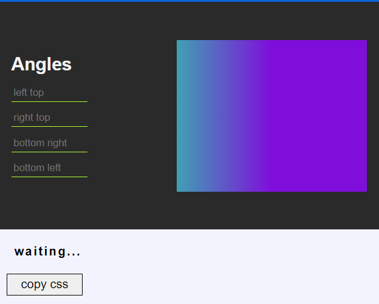
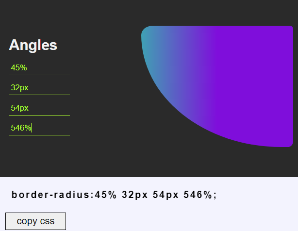
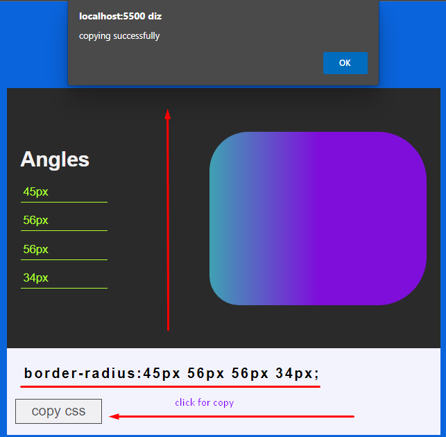

# border radius previewer
> challenge project of the repositorio [florinpop17/appideas](https://github.com/florinpop17/app-ideas.git)

 **technologies used**

- javaScript 
- HTML/CSS

> some images of the project 🔽

> copying css selector

